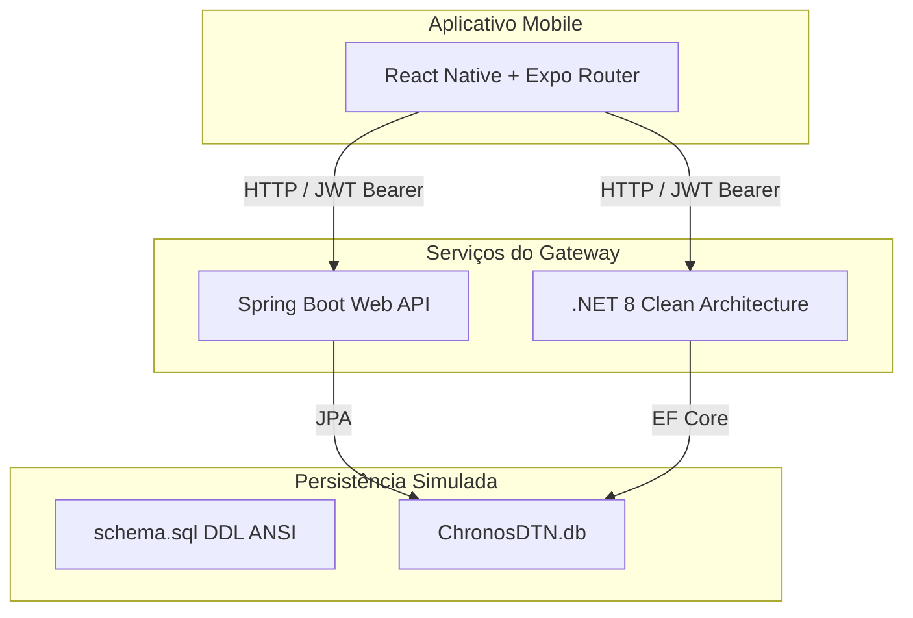

# Chronos DTN: Portal Financeiro e Roteador Interplanetário
### Terra-Lua Delay-Tolerant Network (DTN) & Gateway de Compensação Temporal

O **Chronos DTN** é um ecossistema de software de missão crítica projetado para simular e operar transações comerciais e roteamento tolerante a falhas (DTN) na cislunar e superfície da Lua. Ele resolve os desafios de **altas latências e interrupções** (através do Bundle Protocol da iniciativa LunaNet da NASA) e **dilatação temporal relativística** (Coordinated Lunar Time - LTC vs UTC/TAI).

---

## 🌌 Visão Geral da Arquitetura Macro

O ecossistema é composto por quatro camadas integradas:



1. **Persistência Base (`/database`)**:
   - Um arquivo de definição DDL relacional em ANSI SQL para inicializar tabelas compatíveis com MySQL e PostgreSQL (`OPERADORAS_AERO`, `NOS_SATELLITES`, `FILA_PACOTES_DTN`, `TRANSACOES_AUDITADAS`).
   - Sementes de dados simulando os principais nós e latências de satélites do programa Artemis e LunaNet.

2. **Backend Java (`/backend-java`)**:
   - Desenvolvido em **Java 21** e **Spring Boot 3.2.5**.
   - Responsável pelas auditorias financeiras espaciais, fornecendo um algoritmo de **Compensação Relativística LTC -> UTC** com fidelidade de microssegundos.
   - Fornece segurança JWT, CORS e representações de recursos em **HATEOAS** para histórico de auditoria.

3. **Backend .NET (`/backend-dotnet`)**:
   - Desenvolvido em **C#** e **.NET 8.0** seguindo os princípios de **Clean Architecture** (Domain, Application, Infrastructure, API).
   - Gerencia a persistência via **Entity Framework Core** com SQLite e sementes automáticas na migração.
   - Expõe controladores de fila de pacotes e manutenção de nós satélites, integrados ao mesmo fluxo de segurança JWT.

4. **Frontend Mobile (`/mobile-app`)**:
   - Desenvolvido em **React Native** com o roteador de navegação estruturada **Expo Router**.
   - Contém 5 telas interativas: Dashboard de Telemetria, Auditor de Carimbo de Tempo (LTC/UTC), Gerenciador de Nós (CRUD), Fila DTN de Retenção e Perfil de Acesso.
   - Fornece um cliente HTTP Axios customizado com interceptadores de carregamento, alertas de rede globais e gerenciamento seguro de tokens.
   - Suporta um **Modo de Simulação Offline** completo para demonstrações mesmo com as APIs desconectadas.

---

## ⏱️ Princípio da Compensação Relativística (LTC)

O Coordinated Lunar Time (LTC) corre aproximadamente **56,02 microssegundos mais rápido por dia terrestre** do que o tempo na Terra.
Para manter a sincronização financeira e evitar fraudes de timestamp (front-running interplanetary), o sistema utiliza carimbos de tempo em **microssegundos desde o Unix Epoch** representados em inteiros de 64 bits (`long`).

O `TimeAuditingService` aplica a correção linear baseada em uma época de referência de simulação ($t_0$):
$$\Delta t = t_{lunar\_raw} - t_0$$
$$t_{earth\_corrected} = t_{lunar\_raw} - \left( \Delta t \times \frac{56.02 \times 10^{-6}}{86400} \right)$$
$$desvio = t_{lunar\_raw} - t_{earth\_corrected}$$

---

## 🛠️ Instruções de Execução

### 1. Inicializando o Backend Java
```bash
cd backend-java
# Compilar e executar testes (JUnit + MockMvc)
mvn clean test
# Iniciar a API
mvn spring-boot:run
# Swagger OpenAPI disponível em: http://localhost:8080/swagger-ui/index.html
```

### 2. Inicializando o Backend .NET
```bash
cd backend-dotnet
# Compilar a solução
dotnet build
# Executar as migrações e subir o Web API
dotnet run --project ChronosDTN.API
# Swagger UI disponível em: http://localhost:5246/swagger/index.html (Porta dinâmica configurada no launchSettings)
```

### 3. Executando o Mobile
```bash
cd mobile-app
# Instalar dependências (caso não tenham sido cacheadas)
npm install
# Iniciar o Expo Dev Server
npm start
# Pressione 'w' para carregar no navegador web, ou escaneie o QR Code com o aplicativo Expo Go no Android/iOS
```

---

## 📝 Compliance & Governança de Rede

Todos os componentes seguem as especificações:
- **Delay-Tolerant Networking (RFC 5050 / RFC 9171)**: Roteamento de Store-and-Forward na fila de retenção.
- **Bundle Protocol Security (BPSec)**: Transações assinadas e auditadas via SHA-256 no banco de dados.
- **Microsecond Timestamp Integers**: Tipagem estrita de 64 bits para carimbo temporal em todo o fluxo de rede.
